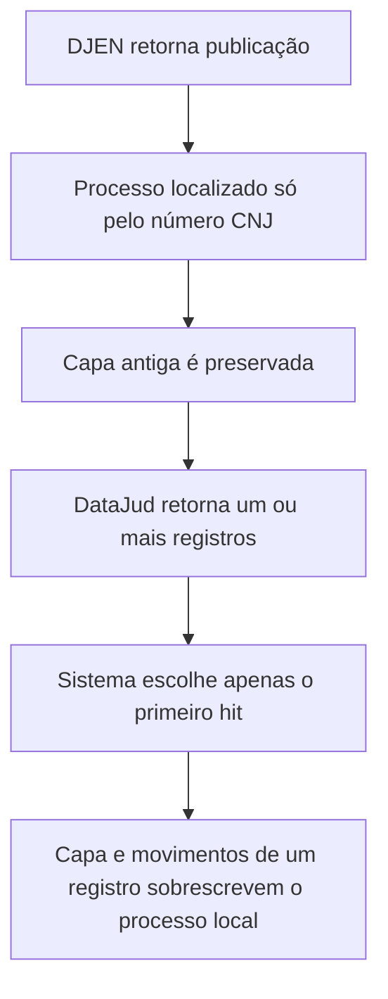

# JUDS — diagnóstico de divergência entre processos e movimentos

**Repositório:** `edumartinsrib/juds`
**Branch analisada:** `main`
**Commit de referência:** [`84bc1e0`](https://github.com/edumartinsrib/juds/commit/84bc1e06f47f1b33a9bb7736ebb5d5e98c5eb275)
**Data da análise:** 28/07/2026

## Conclusão executiva

A divergência observada é compatível com falhas estruturais confirmadas no código. O problema principal não está na ordenação dos movimentos do DataJud, que é feita corretamente, mas na forma como o sistema escolhe e representa o processo ao qual esses movimentos pertencem.

As causas mais relevantes são:

1. **A consulta ao DataJud pede apenas um resultado e aceita o primeiro retorno**, embora a própria API possa retornar mais de um registro para a mesma numeração. Não há validação final do `numeroProcesso`, grau, classe ou órgão antes de sobrescrever a capa e o histórico local.
2. **O modelo local reduz a identidade do processo apenas ao número CNJ.** Já o identificador do DataJud inclui tribunal, classe, grau e órgão julgador. Diferentes registros/instâncias do mesmo número são, portanto, colapsados em uma única linha local.
3. **A capa obtida do DJEN fica congelada com os primeiros dados encontrados.** Comunicações posteriores podem trazer nova classe ou novo órgão, mas esses campos só são preenchidos quando estão vazios. Assim, uma publicação correta e atual pode aparecer sob uma capa antiga.
4. **A deduplicação de comunicações ignora correções da fonte.** Se `id`, `hash` ou fingerprint já existir, o item é descartado sem conferir se o número do processo mudou. Em uma retificação do DJEN, a comunicação pode continuar vinculada ao processo anterior.
5. **A interface chama publicações do DJEN e movimentos processuais do DataJud pelo mesmo nome**, apresenta as duas fontes em áreas diferentes e usa sentidos cronológicos opostos. Isso dificulta distinguir divergência real de divergência de apresentação.

Sem acesso ao banco utilizado na validação, não é possível apontar quais registros concretos foram afetados. Entretanto, os caminhos acima são reproduzíveis a partir do código e explicam diretamente o comportamento descrito.

## Como a divergência é criada

## Evidências no código

### 1. Seleção não determinística do DataJud — criticidade alta

Em [`backend/app/datajud.py`](https://github.com/edumartinsrib/juds/blob/84bc1e06f47f1b33a9bb7736ebb5d5e98c5eb275/backend/app/datajud.py#L163-L199), a requisição usa `"size": 1` e depois escolhe `hits[0]`. O campo `total` é calculado, mas não participa da decisão e nem é persistido.

A documentação oficial do DataJud informa que a consulta por número pode retornar metadados de **um ou mais processos**. O identificador oficial também contém `Tribunal_Classe_Grau_OrgaoJulgador_NumeroProcesso`, enquanto a implementação local compara apenas o número CNJ:

- [Exemplo oficial de consulta por número](https://datajud-wiki.cnj.jus.br/api-publica/exemplos/exemplo1/)
- [Glossário oficial do DataJud](https://datajud-wiki.cnj.jus.br/api-publica/glossario/)

Após receber o primeiro hit, [`backend/app/importer.py`](https://github.com/edumartinsrib/juds/blob/84bc1e06f47f1b33a9bb7736ebb5d5e98c5eb275/backend/app/importer.py#L642-L672) substitui tribunal, classe, órgão e todo o payload de movimentos do processo local. Não existe verificação de que:

- `source.numeroProcesso` seja exatamente igual ao número solicitado;
- o tribunal retornado seja o esperado;
- o grau, a classe ou o órgão sejam compatíveis com a capa selecionada;
- outro hit seja mais atual ou mais adequado.

**Efeito:** movimentos de outro registro, grau ou órgão podem ser apresentados como se fossem do registro que originou a capa local.

### 2. Identidade local insuficiente — criticidade alta

[`backend/app/models.py`](https://github.com/edumartinsrib/juds/blob/84bc1e06f47f1b33a9bb7736ebb5d5e98c5eb275/backend/app/models.py#L101-L138) torna `numero_processo` globalmente único. Isso impede representar separadamente registros do mesmo número que tenham graus, classes ou órgãos distintos.

**Efeito:** o sistema mistura, em um único agregado:

- publicações de diferentes momentos/órgãos;
- capas distintas retornadas pelo DataJud;
- movimentos associados a registros de origem diferentes.

### 3. Capa do DJEN permanece com o primeiro valor — criticidade alta

Em [`backend/app/importer.py`](https://github.com/edumartinsrib/juds/blob/84bc1e06f47f1b33a9bb7736ebb5d5e98c5eb275/backend/app/importer.py#L431-L459), um processo existente é localizado somente pelo número. Tribunal, classe, órgão e link são atualizados usando `valor_atual or valor_novo`.

Depois que o primeiro valor é gravado, mudanças legítimas vindas de publicações posteriores são ignoradas. Apenas `last_communication_at` é atualizado pela data mais recente.

**Efeito:** a publicação pode estar vinculada ao número correto, mas parecer incoerente porque a tela exibe uma classe, um órgão ou um link antigos.

### 4. Deduplicação não reconcilia retificações — criticidade alta

Em [`backend/app/importer.py`](https://github.com/edumartinsrib/juds/blob/84bc1e06f47f1b33a9bb7736ebb5d5e98c5eb275/backend/app/importer.py#L357-L389), a busca por comunicação existente usa `OR` entre fingerprint, `djen_id` e `djen_hash`. Ao encontrar qualquer correspondência, a implementação reaproveita o `process_id` já gravado e ignora os dados novos.

Não há comparação entre:

- número recebido agora;
- `communication.numero_processo`;
- número do `Process` vinculado;
- payload anterior e payload retificado.

**Efeito:** se a fonte corrigir o processo de uma publicação mantendo um identificador estável, o JUDS preserva silenciosamente o vínculo antigo.

### 5. Validação de entrada insuficiente — criticidade média

O número processual é reduzido a dígitos, mas não há validação dos 20 dígitos nem do padrão CNJ antes da persistência. Além disso, todos os itens devolvidos pela busca por `nomeParte` são importados. A correspondência do cliente com `destinatarios` é usada apenas para classificar CPF/polo; ela não decide se o item deve ser aceito.

O método `party_matches_client` usa inclusão de uma string na outra. Homônimos, nomes abreviados e nomes contidos em nomes maiores podem produzir associação indevida.

**Efeito:** resultados incertos entram como processos válidos e passam a receber enriquecimento automático.

### 6. A apresentação mistura conceitos e cronologias — criticidade média

No detalhe do processo, [`backend/app/api.py`](https://github.com/edumartinsrib/juds/blob/84bc1e06f47f1b33a9bb7736ebb5d5e98c5eb275/backend/app/api.py#L668-L687) ordena comunicações DJEN da mais antiga para a mais nova. Os movimentos do DataJud são ordenados da mais nova para a mais antiga em [`backend/app/datajud.py`](https://github.com/edumartinsrib/juds/blob/84bc1e06f47f1b33a9bb7736ebb5d5e98c5eb275/backend/app/datajud.py#L290-L318).

Na tela, ambos aparecem sob o conceito de “movimentações”, embora o DJEN forneça publicações/comunicações e o DataJud forneça movimentos processuais. A publicação também não mostra sua classe e seu órgão próprios, apesar de esses campos estarem armazenados.

**Efeito:** o usuário compara a capa atual com um texto sem proveniência suficiente e duas listas com sentidos cronológicos diferentes.

## Plano de correção

### P0 — Auditoria e contenção imediata

**Objetivo:** impedir novos vínculos silenciosamente incorretos e medir o passivo existente.

1. Criar um comando de auditoria que verifique:
   - `communications.numero_processo <> processes.numero_processo`;
   - número extraído de `communications.raw_payload` diferente do número persistido;
   - `datajud_payload.numeroProcesso` diferente do número do processo;
   - processos com mais de uma classe ou órgão nas comunicações;
   - respostas DataJud com `total > 1`;
   - números ausentes, inválidos ou fora do padrão CNJ.
2. Persistir `datajud_hit_count`, `datajud_source_id` e o motivo de seleção do hit.
3. Quando houver múltiplos hits ou conflito de número, não sobrescrever a capa automaticamente. Registrar o caso como `needs_review`.
4. Adicionar logs estruturados com `process_id`, número solicitado, número retornado, hit escolhido, grau, classe e órgão.

**Critério de aceite:** nenhuma divergência passa a ser tratada como sincronização bem-sucedida sem evidência da escolha.

### P1 — Corrigir a identidade e a seleção do DataJud

**Objetivo:** representar corretamente as diferentes ocorrências oficiais relacionadas ao mesmo número CNJ.

Modelo recomendado:

- `processes`: processo canônico, identificado pelo número CNJ;
- `process_instances` ou `process_sources`: registros oficiais por fonte, com `source`, `source_record_id`, tribunal, grau, classe, órgão e data de atualização;
- `process_events`: eventos normalizados com referência à instância/fonte;
- `source_snapshots`: payload bruto e data de coleta para auditoria.

Alterações:

1. Consultar mais de um hit no DataJud.
2. Filtrar os resultados por igualdade exata de `numeroProcesso`.
3. Persistir cada `_id` retornado, em vez de descartar os demais hits.
4. Escolher a capa corrente por regra explícita e testável, por exemplo:
   - número e tribunal compatíveis;
   - registro com atualização mais recente;
   - preferência pelo grau/órgão selecionado pelo usuário;
   - nunca escolher somente pela posição do hit.
5. Agregar movimentos entre instâncias apenas quando essa for a decisão funcional, sempre preservando `source_record_id`, grau e órgão em cada evento.

**Critério de aceite:** executar a mesma sincronização repetidamente produz a mesma capa e os mesmos movimentos, independentemente da ordem dos hits.

### P2 — Transformar a deduplicação DJEN em reconciliação

**Objetivo:** tratar retificações sem manter vínculos obsoletos.

1. Separar os identificadores:
   - `djen_id` como chave principal da fonte;
   - `djen_hash` e fingerprint como evidências auxiliares/versionamento.
2. Ao encontrar comunicação existente, comparar os campos críticos.
3. Se o número mudou:
   - validar o novo número;
   - registrar a versão anterior;
   - mover/revincular a comunicação em transação;
   - recalcular contadores, partes, riscos e associações de clientes;
   - registrar evento de auditoria.
4. Se identificadores diferentes apontarem para comunicações diferentes, não usar `scalar_one_or_none()` sobre um `OR`; registrar colisão para revisão.
5. Atualizar `raw_payload`, texto, classe, órgão e demais metadados quando a fonte trouxer uma versão mais nova.

**Critério de aceite:** uma retificação do DJEN altera o vínculo de forma rastreável e idempotente.

### P3 — Regras de aceitação e qualidade

**Objetivo:** impedir que resultados frágeis sejam promovidos automaticamente a processos confirmados.

1. Validar formato e dígitos verificadores do número CNJ.
2. Criar estados de associação: `confirmed`, `probable`, `uncertain`, `rejected`.
3. Quando houver CPF na fonte, exigir compatibilidade para confirmação automática.
4. Sem CPF, usar nome normalizado por tokens completos e critérios configuráveis; não usar simples inclusão de substring como única evidência.
5. Manter itens incertos em uma fila de revisão, sem descartá-los.
6. Tornar a relação cliente–comunicação explícita, pois `is_client_match` hoje é gravado de acordo com o primeiro cliente que importou a comunicação.

**Critério de aceite:** homônimos e resultados sem destinatário compatível não aparecem como vínculo confirmado.

### P4 — Unificar API e interface

**Objetivo:** tornar a origem e o contexto de cada evento inequívocos.

1. Criar um DTO de timeline com:
   - `event_id`;
   - `process_id`;
   - `source` (`DJEN` ou `DATAJUD`);
   - `source_record_id`;
   - `event_type` (`publication` ou `procedural_movement`);
   - `occurred_at`;
   - tribunal, grau, classe e órgão do próprio evento;
   - título, texto, complementos e link.
2. Ordenar todas as fontes no mesmo sentido, preferencialmente mais recente primeiro.
3. Exibir badges “Publicação DJEN” e “Movimento DataJud”.
4. Mostrar classe, órgão e grau por evento quando divergirem da capa.
5. Separar contadores: `publicações DJEN`, `movimentos DataJud` e `total de eventos`.
6. Permitir selecionar a instância/grau quando existirem vários registros para o mesmo número.

**Critério de aceite:** cada item da timeline explica visualmente de onde veio e qual contexto processual possuía.

### P5 — Saneamento dos dados existentes

**Objetivo:** corrigir a base atual sem perda de auditoria.

1. Fazer backup antes da migração.
2. Executar o relatório de inconsistências da P0.
3. Criar as instâncias oficiais a partir dos payloads já armazenados.
4. Reconsultar DataJud e DJEN para os processos sinalizados.
5. Reconciliar comunicações corrigidas e recalcular:
   - `communications_count`;
   - `last_movement_at`;
   - capa corrente;
   - partes, polos e status de CPF;
   - riscos e fases.
6. Guardar uma tabela de remapeamento e um relatório antes/depois.

**Critério de aceite:** a consulta de auditoria retorna zero divergências não justificadas.

### P6 — Cobertura automatizada

Adicionar testes para:

- DataJud retornando dois hits com o mesmo número e graus diferentes;
- primeiro hit incompatível e segundo hit compatível;
- `_source.numeroProcesso` divergente;
- DJEN retificando uma comunicação para outro processo;
- colisão entre `djen_id`, `hash` e fingerprint;
- mesmo número com mudança de classe e órgão;
- homônimo e nome parcial;
- número CNJ inválido;
- ordenação unificada da timeline;
- reprocessamento idempotente;
- migração e saneamento de dados históricos.

Usar como fixtures de aceitação os processos que já apresentaram divergência na validação manual.

## Ordem recomendada de execução

| Etapa | Prioridade | Estimativa | Dependência |
|---|---:|---:|---|
| Auditoria e bloqueio de seleção ambígua | P0 | 1 dia | Nenhuma |
| Seleção DataJud e modelo de instâncias | P0 | 3–5 dias | Auditoria |
| Reconciliação de retificações DJEN | P0 | 2–3 dias | Modelo |
| Regras de aceitação e relação cliente–comunicação | P1 | 2–3 dias | Modelo |
| API/timeline com proveniência | P1 | 2–3 dias | Modelo |
| Saneamento da base | P1 | 1–3 dias | Correções anteriores |
| Testes, métricas e documentação operacional | P1 | 2 dias | Todas |

**Estimativa total:** 13–20 dias úteis, incluindo migração e validação. O primeiro bloqueio de novas divergências pode ser entregue no primeiro dia.

## Critérios globais de conclusão

- Todo evento possui fonte, identificador de origem e número processual auditável.
- Nenhum hit do DataJud é escolhido apenas por ser o primeiro.
- Múltiplos graus/classes/órgãos não são sobrescritos silenciosamente.
- Retificações do DJEN são reconciliadas e versionadas.
- A capa atual é derivada por uma regra explícita e reproduzível.
- Publicações e movimentos são apresentados com nomes e contadores distintos.
- Os casos reais informados pelo usuário passam por testes de regressão.
- A auditoria da base não apresenta vínculos inconsistentes sem justificativa registrada.

## Arquivos principais a alterar

- `backend/app/datajud.py`
- `backend/app/importer.py`
- `backend/app/models.py`
- `backend/app/schemas.py`
- `backend/app/api.py`
- nova migração Alembic
- `backend/tests/test_datajud.py`
- `backend/tests/test_importer.py`
- `backend/tests/test_api.py`
- `frontend/src/types.ts`
- `frontend/src/App.tsx`

## Observação de validação

O código Python foi verificado sintaticamente com `compileall`. A suíte `pytest` não foi executada neste ambiente porque as dependências do projeto não estavam instaladas. A análise não alterou o repositório.

## Status da implementação

Implementado em 28/07/2026:

- seleção DataJud com até 100 hits, igualdade exata de número, desempate determinístico e bloqueio de capa em ambiguidades;
- entidades `process_sources`, `source_snapshots` e `process_events`, preservando registro de origem, grau, classe e órgão por evento;
- reconciliação e versionamento de retificações DJEN, com detecção de colisões entre `djen_id`, hash e fingerprint;
- validação completa do número CNJ e associações cliente–comunicação com estados de confiança;
- auditoria persistida e executável por `python -m app.audit`, com saneamento de registros históricos;
- migração Alembic `0006_process_source_integrity`, relatório antes/depois e tabela de remapeamento;
- timeline única, mais recente primeiro, com badges e contadores distintos para DJEN e DataJud;
- escolha manual de instância DataJud e preservação dessa escolha em sincronizações posteriores;
- regressões automatizadas para os cenários P0–P6 descritos neste documento.

Validação atual:

- `backend/.venv/bin/pytest -q`: 35 testes aprovados;
- `npm run build`: TypeScript e build Vite aprovados;
- migração `0005 -> 0006` validada com dados históricos semeados, incluindo downgrade;
- `alembic check`: nenhuma operação de migração pendente;
- stack isolado validado com PostgreSQL 16, API saudável, worker com heartbeat,
  frontend HTTP 200 e auditoria sem divergências não justificadas.
